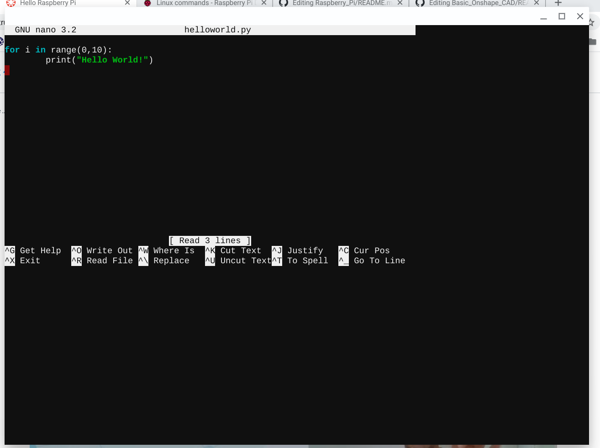
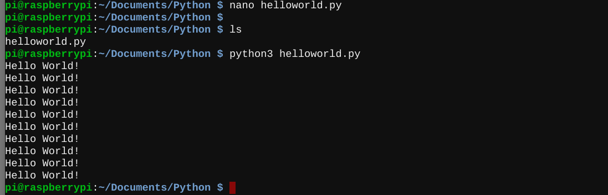

# Raspberry Pi
These are my Engineering 4 assignments to introduce me to the Raspberry Pi.
## Hello Raspberry Pi

### Reflection
This assignment to me a little while to get started on, because I had to replace my first Pi, which wouldn't even turn on.  However, after I did that, Beagle Term (on a chromebook) proved easy to use, and I learned how to create a new directory ("mkdir") and how to make my first Raspberry Pi program with Beagle Term, by editing the .py file in "nano" and then using "python3" to run it.
